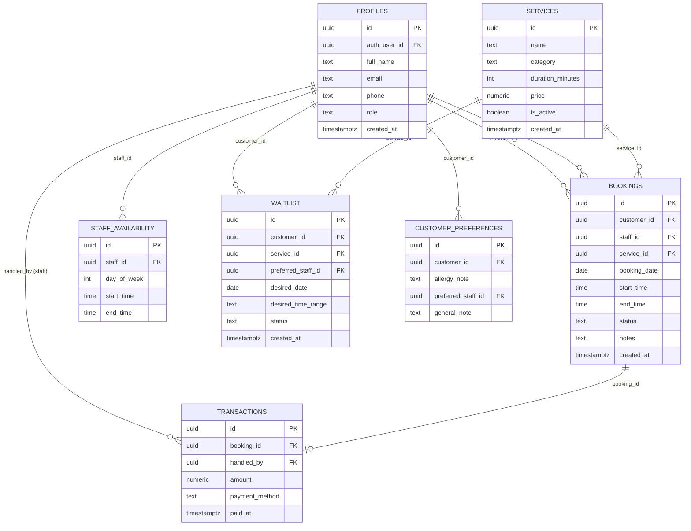

# Entity Relationship Diagram (ERD)
## Sistem Manajemen Salon

**Versi Dokumen:** 1.0
**Referensi:** PRD Sistem Manajemen Salon v1.0
**Database:** PostgreSQL (Supabase)

---

## 1. Pendahuluan

Dokumen ini menerjemahkan kebutuhan fungsional pada PRD (khususnya kategori **Must Have** dan **Should Have** pada kerangka MoSCoW) menjadi skema basis data relasional. Entitas dikelompokkan menjadi dua bagian:

1. **Skema Inti (Core Schema)** — wajib diimplementasikan, mencakup seluruh modul Must Have dan Should Have.
2. **Skema Ekstensi (Extension Schema)** — opsional, mencakup modul Could Have (Inventaris Produk) sebagai referensi jika dikerjakan sebagai *stretch goal*.

Seluruh tabel dirancang dengan asumsi **Supabase Auth** menangani autentikasi (tabel `auth.users` bawaan Supabase, tidak digambarkan ulang di sini), sehingga tabel `profiles` berperan sebagai *extension table* yang berelasi satu-ke-satu dengan `auth.users`.

---

## 2. Diagram Relasi (Notasi Mermaid)



**Catatan teknis:** Notasi di atas menggunakan sintaks Mermaid `erDiagram` yang kompatibel untuk dirender di GitHub, GitLab, maupun editor mendukung Mermaid lainnya — memudahkan penyisipan langsung ke laporan skripsi (Bab Perancangan Sistem) tanpa perlu alat desain terpisah.

---

## 3. Definisi Entitas — Skema Inti

### 3.1 `profiles`
Tabel perluasan dari `auth.users` (Supabase Auth) yang menyimpan atribut bisnis tiga role: admin, staff, customer.

| Kolom | Tipe Data | Constraint | Keterangan |
|---|---|---|---|
| `id` | `uuid` | PK, default `gen_random_uuid()` | ID internal profil |
| `auth_user_id` | `uuid` | FK → `auth.users(id)`, UNIQUE, NOT NULL | Relasi 1:1 ke akun autentikasi |
| `full_name` | `text` | NOT NULL | Nama lengkap |
| `email` | `text` | NOT NULL, UNIQUE | Disinkronkan dari `auth.users.email` |
| `phone` | `text` | NULLABLE | Opsional, sesuai FR-1.1 |
| `role` | `text` | NOT NULL, CHECK IN (`'admin'`,`'staff'`,`'customer'`), DEFAULT `'customer'` | **Kritis:** kolom ini TIDAK boleh diisi dari input client saat registrasi (lihat Bagian 5) |
| `created_at` | `timestamptz` | DEFAULT `now()` | Audit trail |

### 3.2 `services`
Katalog layanan salon, dikelola Admin (FR-2.1, FR-2.2).

| Kolom | Tipe Data | Constraint | Keterangan |
|---|---|---|---|
| `id` | `uuid` | PK | |
| `name` | `text` | NOT NULL | Nama layanan |
| `category` | `text` | NULLABLE | Mis. "Hair", "Nail", "Facial" |
| `duration_minutes` | `int` | NOT NULL, CHECK > 0 | Dasar perhitungan slot booking |
| `price` | `numeric(12,2)` | NOT NULL, CHECK >= 0 | |
| `is_active` | `boolean` | DEFAULT `true` | Soft delete (FR-2.2) — layanan nonaktif tidak muncul di booking baru tapi tetap ada di riwayat transaksi |
| `created_at` | `timestamptz` | DEFAULT `now()` | |

### 3.3 `staff_availability`
Jam kerja staf sebagai dasar validasi slot booking (FR-3.2).

| Kolom | Tipe Data | Constraint | Keterangan |
|---|---|---|---|
| `id` | `uuid` | PK | |
| `staff_id` | `uuid` | FK → `profiles(id)`, NOT NULL | Harus memiliki `role = 'staff'` (divalidasi via trigger/check) |
| `day_of_week` | `int` | NOT NULL, CHECK 0–6 | 0=Minggu ... 6=Sabtu |
| `start_time` | `time` | NOT NULL | |
| `end_time` | `time` | NOT NULL, CHECK > start_time | |

### 3.4 `bookings`
Entitas transaksional utama (FR-4.1 s/d FR-4.4).

| Kolom | Tipe Data | Constraint | Keterangan |
|---|---|---|---|
| `id` | `uuid` | PK | |
| `customer_id` | `uuid` | FK → `profiles(id)`, NOT NULL | Harus `role = 'customer'` |
| `staff_id` | `uuid` | FK → `profiles(id)`, NULLABLE | NULL jika customer tidak memilih staf spesifik |
| `service_id` | `uuid` | FK → `services(id)`, NOT NULL | |
| `booking_date` | `date` | NOT NULL | |
| `start_time` | `time` | NOT NULL | |
| `end_time` | `time` | NOT NULL, GENERATED atau dihitung dari `start_time + services.duration_minutes` | |
| `status` | `text` | NOT NULL, CHECK IN (`'pending'`,`'confirmed'`,`'completed'`,`'cancelled'`), DEFAULT `'pending'` | Sesuai state machine FR-4.4 |
| `notes` | `text` | NULLABLE | |
| `created_at` | `timestamptz` | DEFAULT `now()` | |

**Constraint kritis (FR-4.2):**
```sql
-- Mencegah double booking pada staf yang sama di rentang waktu yang sama
CREATE UNIQUE INDEX idx_no_double_booking
ON bookings (staff_id, booking_date, start_time)
WHERE status IN ('pending', 'confirmed');
```
Constraint ini **wajib** diterapkan di level database (bukan hanya validasi UI), karena UI dapat dilewati melalui manipulasi request langsung ke Supabase API.

### 3.5 `transactions`
Pencatatan pembayaran manual oleh staff (FR-5.1, FR-5.2).

| Kolom | Tipe Data | Constraint | Keterangan |
|---|---|---|---|
| `id` | `uuid` | PK | |
| `booking_id` | `uuid` | FK → `bookings(id)`, UNIQUE, NOT NULL | Relasi 1:1 — satu booking maksimal satu transaksi |
| `handled_by` | `uuid` | FK → `profiles(id)`, NOT NULL | Staf yang mencatat transaksi (merangkap kasir) |
| `amount` | `numeric(12,2)` | NOT NULL, CHECK >= 0 | |
| `payment_method` | `text` | NOT NULL, CHECK IN (`'cash'`,`'transfer'`,`'qris_manual'`) | Dropdown manual, tanpa gateway (FR-5.1) |
| `paid_at` | `timestamptz` | DEFAULT `now()` | |

### 3.6 `waitlist`
Daftar tunggu jika slot penuh (FR-9.1).

| Kolom | Tipe Data | Constraint | Keterangan |
|---|---|---|---|
| `id` | `uuid` | PK | |
| `customer_id` | `uuid` | FK → `profiles(id)`, NOT NULL | |
| `service_id` | `uuid` | FK → `services(id)`, NOT NULL | |
| `preferred_staff_id` | `uuid` | FK → `profiles(id)`, NULLABLE | |
| `desired_date` | `date` | NOT NULL | |
| `desired_time_range` | `text` | NULLABLE | Mis. "10:00–12:00", disimpan sebagai teks bebas untuk fleksibilitas MVP |
| `status` | `text` | CHECK IN (`'waiting'`,`'notified'`,`'expired'`), DEFAULT `'waiting'` | |
| `created_at` | `timestamptz` | DEFAULT `now()` | |

### 3.7 `customer_preferences`
Catatan preferensi pelanggan (FR-8.2), relasi 1:1 dengan `profiles` (khusus role customer).

| Kolom | Tipe Data | Constraint | Keterangan |
|---|---|---|---|
| `id` | `uuid` | PK | |
| `customer_id` | `uuid` | FK → `profiles(id)`, UNIQUE, NOT NULL | |
| `allergy_note` | `text` | NULLABLE | |
| `preferred_staff_id` | `uuid` | FK → `profiles(id)`, NULLABLE | |
| `general_note` | `text` | NULLABLE | |

**Catatan desain:** Riwayat kunjungan (visit history, FR-8.1) **tidak memerlukan tabel baru** — cukup query `bookings` dengan filter `status = 'completed'` dan `customer_id`. Ini contoh prinsip *avoid data redundancy*: informasi yang sudah bisa diturunkan (derived) dari tabel lain tidak perlu diduplikasi ke tabel terpisah.

---

## 4. Definisi Entitas — Skema Ekstensi (Opsional/Stretch Goal)

Tabel berikut **tidak wajib** diimplementasikan pada versi MVP. Disertakan sebagai referensi jika modul Inventaris Produk (FR-10.1) dikerjakan setelah skema inti selesai dan stabil.

### 4.1 `products`
| Kolom | Tipe Data | Constraint | Keterangan |
|---|---|---|---|
| `id` | `uuid` | PK | |
| `name` | `text` | NOT NULL | |
| `stock_quantity` | `int` | NOT NULL, CHECK >= 0 | |
| `unit` | `text` | NULLABLE | Mis. "ml", "pcs" |

### 4.2 `service_product_usage`
Tabel penghubung many-to-many antara `services` dan `products` (berapa banyak produk terpakai per layanan).

| Kolom | Tipe Data | Constraint | Keterangan |
|---|---|---|---|
| `id` | `uuid` | PK | |
| `service_id` | `uuid` | FK → `services(id)`, NOT NULL | |
| `product_id` | `uuid` | FK → `products(id)`, NOT NULL | |
| `quantity_used` | `numeric` | NOT NULL, CHECK > 0 | Dikurangkan dari `products.stock_quantity` otomatis via trigger saat transaksi tercatat |

---

## 5. Ringkasan Kebijakan Row Level Security (RLS)

Sesuai analisis kritis pada PRD Bagian 5, setiap tabel inti **wajib** memiliki RLS aktif. Ringkasan kebijakan per tabel:

| Tabel | Customer | Staff | Admin |
|---|---|---|---|
| `profiles` | SELECT/UPDATE baris milik sendiri saja | SELECT baris milik sendiri saja | SELECT/UPDATE semua baris |
| `services` | SELECT (read-only, hanya `is_active = true`) | SELECT semua | ALL (CRUD penuh) |
| `staff_availability` | SELECT (read-only, untuk keperluan booking) | SELECT/UPDATE baris milik sendiri | ALL |
| `bookings` | SELECT/INSERT/UPDATE baris dengan `customer_id = auth.uid()` (via profiles) | SELECT/UPDATE baris dengan `staff_id = auth.uid()` | ALL |
| `transactions` | Tidak ada akses langsung | INSERT/SELECT terbatas pada booking yang ia tangani | ALL |
| `waitlist` | SELECT/INSERT/DELETE baris milik sendiri | SELECT (read-only) | ALL |
| `customer_preferences` | SELECT/UPDATE baris milik sendiri | SELECT (read-only, untuk kebutuhan operasional) | ALL |

**Catatan implementasi:** Kolom `role` pada `profiles` dijadikan basis fungsi helper SQL (mis. `is_admin()`, `is_staff()`) yang dipanggil dalam definisi *policy* RLS, agar kebijakan tidak perlu ditulis ulang di setiap tabel secara manual — ini mengurangi risiko human error saat menulis policy satu per satu.

---

## 6. Validasi Silang terhadap PRD

| Kebutuhan PRD | Elemen ERD Terkait | Status |
|---|---|---|
| FR-1.1–1.4 (Autentikasi) | `profiles` + `auth.users` (Supabase bawaan) | ✅ Terpenuhi |
| FR-2.1–2.2 (Manajemen Layanan) | `services` | ✅ Terpenuhi |
| FR-3.1–3.2 (Manajemen Staf) | `profiles` (role staff) + `staff_availability` | ✅ Terpenuhi |
| FR-4.1–4.4 (Booking) | `bookings` + unique constraint anti double-booking | ✅ Terpenuhi |
| FR-5.1–5.3 (Transaksi) | `transactions` | ✅ Terpenuhi |
| FR-6.1–6.2 (Notifikasi) | Tidak memerlukan tabel baru — dipicu oleh perubahan `status` pada `bookings` melalui Supabase Function/trigger + Resend API | ✅ Terpenuhi (di luar skema data) |
| FR-7.1–7.2 (Pelaporan) | Query agregat lintas `bookings` + `transactions`, tidak memerlukan tabel baru | ✅ Terpenuhi |
| FR-8.1–8.2 (Profil & Preferensi) | `bookings` (derived) + `customer_preferences` | ✅ Terpenuhi |
| FR-9.1–9.2 (Waitlist/Reschedule) | `waitlist` | ✅ Terpenuhi |
| FR-10.1 (Inventaris, opsional) | `products` + `service_product_usage` (skema ekstensi) | ⏸️ Opsional, belum wajib |

---

## 7. Kesimpulan

Skema inti (7 tabel: `profiles`, `services`, `staff_availability`, `bookings`, `transactions`, `waitlist`, `customer_preferences`) mencakup seluruh kebutuhan fungsional kategori Must Have dan Should Have pada PRD tanpa redundansi data. Constraint unik pada `bookings` (anti double-booking) dan kebijakan RLS per tabel merupakan dua elemen yang secara langsung menjawab risiko keamanan yang diidentifikasi pada analisis PRD Bagian 5 — sehingga skema ini tetap konsisten dengan prinsip "registrasi sederhana, kontrol akses tidak dikorbankan".

**Langkah selanjutnya yang disarankan:** menuliskan definisi SQL lengkap (`CREATE TABLE` + RLS policy) sebagai lampiran teknis skripsi, serta memverifikasi constraint anti-double-booking dengan skenario uji (test case) sebelum masuk fase implementasi di Antigravity.